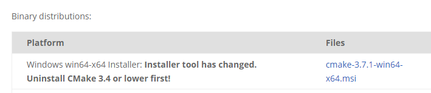
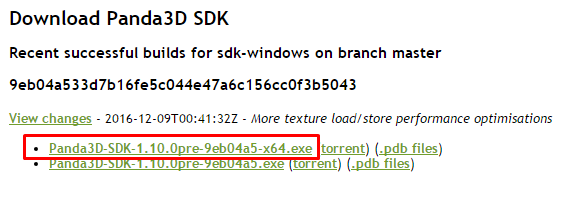

# Getting started on windows

## Requirements
- Basic knowledge of Panda3D and Python
- Windows 7 or higher

This is the first tutorial of the render pipeline tutorial series. We will cover how to
setup your Panda3D installation and the Render Pipeline.
This is the base for all upcoming tutorials, so make sure you follow it carful!

To be able to do so, we need to install some tools:

## Installing the compilers

First of all, you will have to install the Windows 7.1 SDK to get the required compilers *:

1. Uninstall *Microsoft Visual C++ 2010 Redistributable* if present
   (all versions and architectures). If present, it can cause an error on Windows SDK 7.1 installation. 
2. Install <a href="https://www.microsoft.com/download/details.aspx?id=24872" target="_blank">Microsoft .NET Framework 4</a>
   if not present. 
3. Install <a href="https://www.microsoft.com/download/details.aspx?id=8279" target="_blank">Microsoft Windows SDK for Windows 7 and .NET Framework 4</a>.
   Check Windows headers and libraries, Visual C++ Compilers and Windows Native Code Development\Tools options only. 
4. Install <a href="https://www.microsoft.com/download/details.aspx?id=4422" target="_blank">Microsoft Visual C++ 2010 Service Pack 1 Compiler Update for the Windows SDK 7.1</a>. This updates the compiler to Visual C++ 10.0 SP1. 
5. Reinstall <a href="https://www.microsoft.com/download/details.aspx?id=26999" target="_blank">Microsoft Visual C++ 2010 Redistributable</a> (for all previously installed architectures). 

## Installing CMake

The render pipeline also requires CMake, you can download it from <a href="https://cmake.org/download/" target="_blank">here</a> (Choose *Latest Stable* > *Windows win64-x64 Installer*):

## Installing Panda3D

Now that we have the all required tools installed installed, we can grab a pre-compiled development version of Panda3D.
First, download the latest buildbot build from <a href="http://www.panda3d.org/download.php?platform=windows&version=devel&sdk" target="_blank">here</a>
(I recommend using a 64bit build ending with `-x64`):

Run the installer, which will ask you where to install Panda3D. You can install it at any location, it does not matter for this tutorial.
Also, leave all features checked in the installer.

## Installing latest graphics drivers

Before we can install the render pipeline, we have to make sure that the graphics drivers are up to date.
You can get the latest NVIDIA drivers from <a href="http://www.nvidia.com/download/index.aspx" target="_blank">here</a>, and for
AMD cards you can find them <a href="http://support.amd.com/de-de/download" target="_blank">here</a>

## Installing the Render Pipeline

Since all requirements are satisfied now, we can start to install the render pipeline.
First, download the <a href="http://github.com/tobspr/RenderPipeline" target="_blank">Render Pipeline</a>. You can so by using the *Download ZIP* button:

Extract the folder to your workspace, for the following tutorials I will use `C:/MyProject/render_pipeline/`, but it literally doesn't matter.

In the future, I will refer to `workspace` as your workspace folder, e.g. `C:/MyProject`, and refer to
`render pipeline folder` or `pipeline folder` as the root folder of the render pipeline, e.g. `C:/MyProject/render_pipeline` 

---

(*) Windows SDK Installation steps taken from the <a href="https://wiki.python.org/moin/WindowsCompilers#Microsoft_Visual_C.2B-.2B-_10.0_standalone:_Windows_SDK_7.1_.28x86.2C_x64.2C_ia64.29" target="_blank">Python Wiki</a>
