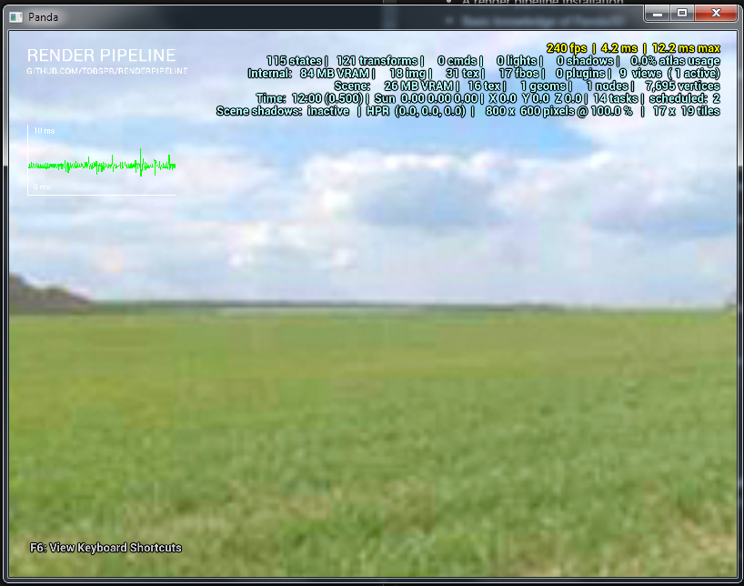

# Creating a simple application

## Requirements
- A render pipeline installation
- Basic knowledge of Panda3D
- A text editor / python ide of your choice

In this tutorial we will cover how to create your first application using the render pipeline.
This requires that you successfully installed the render pipeline as described in the previous tutorials.

## Creating the application

To create our first application, create a new file named `main.py` in your workspace.
Open the file in your favourite text editor or ide.
We will now create our first application, step by step (you can find the full code <a href="main.py">here</a>).

First of all, we need to import the `ShowBase` class, this is no different to regular Panda3D applications.
We also include the `sys` module, since we will need it later:

```python
import sys
from direct.showbase.ShowBase import ShowBase
```

Now that all classes are imported, we need to create our main application class, which derives
from ShowBase:

```python
class Application(ShowBase):
    def __init__(self):
```

Since the render pipeline is stored in a sub-folder (We called it `render_pipeline` in the previous tutorial),
we have to tell the python interpreter where to find it (Thats where we needed the `sys` import for):

```python
        sys.path.insert(0, "render_pipeline")
```

The python interpreter will now additionally look in the render pipeline folder when resolving imports, and
we can import the render pipeline base class:

```python
        from rpcore import RenderPipeline
```

We can now use the render pipeline class, and initializing it is pretty straightforward:

```python
        self.render_pipeline = RenderPipeline()
        self.render_pipeline.create(self)
```

Notice that the `create()` call already initializes the `ShowBase` class for us, you must not do this yourself as
opposed to regular Panda3D applications.

Finally, we have to create an instance of our application class, and call the `run()` method, which
will start it:

```python
Application().run()
```

Thats it! We can now run the application (You can find the full source code <a href="main.py">here</a>).

## Running the application

You can now open a command shell and navigate to your workspace folder. Type `ppython main.py`, and a window
similar to this should open (The actual content may vary, depending on the render pipeline version):




