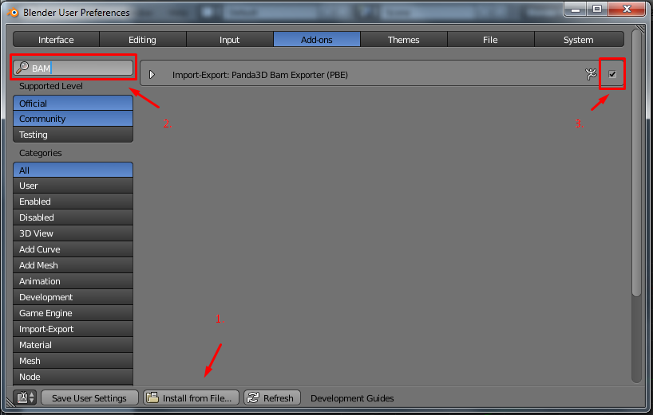
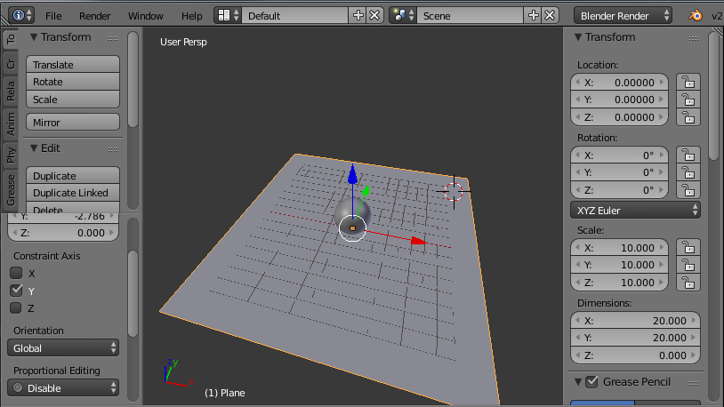
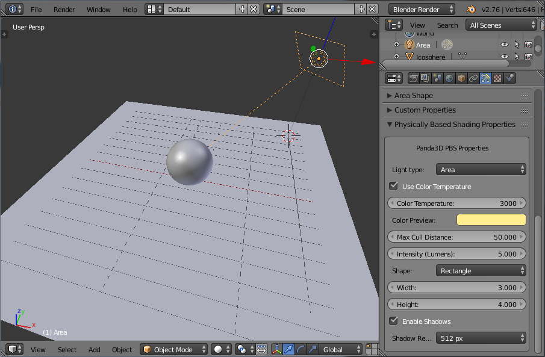
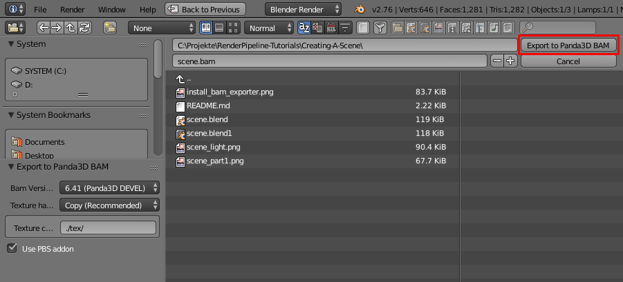

# Creating a scene in blender

## Requirements
- A render pipeline installation
- A Blender installation
- Basic blender knowledge

In this tutorial we will cover how to properly create models and lights in blender
so they can be used in the render pipeline. We will also cover how to install
the bam exporter.

However, this is not a blender tutorial. If you are not familar with blender,
I recommend checking out the <a href="https://www.blender.org/support/tutorials/">Blender Tutorials</a> first.

You can find the scene we will model in the this tutorial <a href="scene.blend">here</a>.

## Installing the BAM exporter

To be able to export our models, we need to install the bam exporter plugin for blender:

Head over to the <a href="https://github.com/tobspr/Panda3D-Bam-Exporter/releases/">Panda3D Bam Exporter Releases</a> page
and download the latest zip.

Next, open Blender, and select `File` > `User Preferences`. The preferences window
should open:

1. Go to the *Addons* tab, click `Install from file ...` and locate the zip file you just downloaded.
2. Type `BAM` in the search field. The extensions should now show up.
3. Ensure the extension is enabled, by checking its checkbox

If any issues occur, please fill out an issue <a href="https://github.com/tobspr/Panda3D-Bam-Exporter/issues">here</a> (Really, please!).

## Creating your scene

I will not focus in depth about how to model a scene, and we will really keep it simple
here. Assuming we already modelled this geometry (notice I deleted the standard light and camera):

### Adding lights

To make our objects shaded, we will add a rectangle area light. To do so, 
hit <kbd>Space</kbd> and enter `Add Lamp`, then select `Area`. An area light should be
created, and if you go to the object light data, you will see the light properties
(notice I already moved the light, and changed its size and color):

### Exporting the scene

To export the scene, press <kbd>Space</kbd> and type `BAM`. You should see the
option `Export to Panda3D BAM`, which you can execute with <kbd>Enter</kbd>.

A screen similar to the one below will show up, for now we do not need to modify
the options, and can just press `Export to Panda3D BAM` in the top right corner:

  

### Loading the scene

