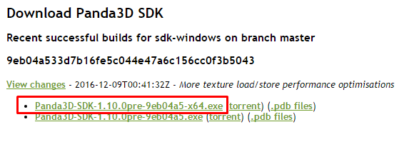
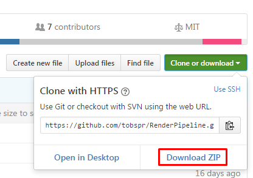
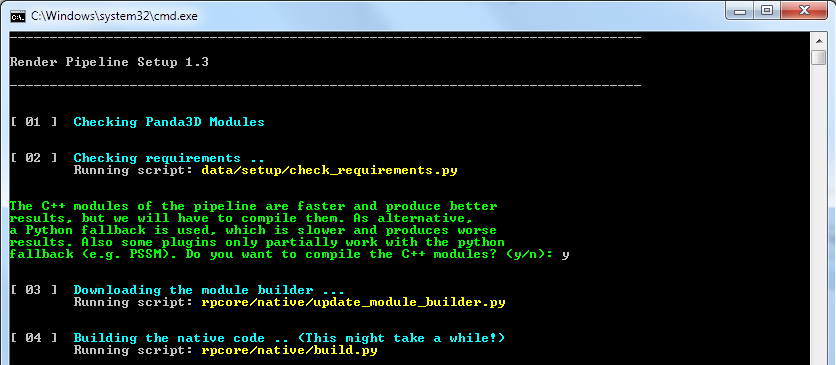

# Getting started on Windows

## Requirements
- Basic knowledge of Panda3D and Python
- Basic knowledge of how to use a command shell
- Windows 7 or higher

## Overview
This is the first tutorial of the RenderPipeline tutorial series. We will cover how to
setup your Panda3D installation and the RenderPipeline.
This is the base for all upcoming tutorials, so make sure you follow it carful!

To be able to do so, we need to install some tools:

## Installing the compilers

First of all, you will have to install the Windows 7.1 SDK to get the required compilers *:

1. Uninstall *Microsoft Visual C++ 2010 Redistributable* if present
   (all versions and architectures). If present, it can cause an error on Windows SDK 7.1 installation. 
2. Install <a href="https://www.microsoft.com/download/details.aspx?id=24872" target="_blank">Microsoft .NET Framework 4</a>
   if not present. 
3. Install <a href="https://www.microsoft.com/download/details.aspx?id=8279" target="_blank">Microsoft Windows SDK for Windows 7 and .NET Framework 4</a>.
   Check Windows headers and libraries, Visual C++ Compilers and Windows Native Code Development\Tools options only. 
4. Install <a href="https://www.microsoft.com/download/details.aspx?id=4422" target="_blank">Microsoft Visual C++ 2010 Service Pack 1 Compiler Update for the Windows SDK 7.1</a>. This updates the compiler to Visual C++ 10.0 SP1. 
5. Reinstall <a href="https://www.microsoft.com/download/details.aspx?id=26999" target="_blank">Microsoft Visual C++ 2010 Redistributable</a> (for all previously installed architectures). 

## Installing CMake

The RenderPipeline also requires CMake.
You can download it from <a href="https://cmake.org/download/" target="_blank">here</a> (Choose *Latest Stable* > *Windows win64-x64 Installer*):

## Installing Panda3D

Now that we have the all required tools installed, we can grab a pre-compiled, development version of Panda3D.
First, download the latest buildbot build from <a href="http://www.panda3d.org/download.php?platform=windows&version=devel&sdk" target="_blank">here</a>
(I recommend using a 64bit build ending with `-x64`):

Next, run the installer, which will ask you where to install Panda3D.
You can install it at any location, which does not matter for this tutorial.
Also, leave all features checked in the installer.

After you have installed Panda3D, we have to make sure `ppython` is on your path. Press <kbd>Windows</kbd>+<kbd>R</kbd> and type `cmd`.
A command shell will open, enter `ppython`. If a python interpreter opens, you are done and can close- the shell.

If you get `ppython is not a recognized internal command`, head over to <a href="https://www.panda3d.org/manual/index.php/Installing_Panda3D_in_Windows">Installing Panda3D in Windows</a>
which describes how to fix this.

## Installing latest graphics drivers

Before we can install the RenderPipeline, we have to make sure that the graphics drivers are up to date.
You can get the latest NVIDIA drivers from <a href="http://www.nvidia.com/download/index.aspx" target="_blank">here</a>, and for
AMD cards you can find them <a href="http://support.amd.com/de-de/download" target="_blank">here</a>

## Installing the RenderPipeline

Since all other requirements are satisfied now, we can start to install the RenderPipeline.
First, download the <a href="http://github.com/tobspr/RenderPipeline" target="_blank">RenderPipeline</a>. You can do so by using the *Download ZIP* button:

Extract the folder to your workspace. For the following tutorials I will use `C:/MyProject/render_pipeline/`, but it doesn't matter.

In the future, I will refer to `workspace` as your workspace folder, e.g. `C:/MyProject`, and refer to
`RenderPipeline folder` or `pipeline folder` as the root folder of the RenderPipeline, e.g. `C:/MyProject/render_pipeline`.

Now that you downloaded the RenderPipeline, we have to build and set it up. Open a command shell, and navigate to the 
RenderPipeline folder, e.g. `cd /D C:/MyProject/render_pipeline/`. 

Now, type `ppython setup.py`. The RenderPipeline setup should start:

The setup will ask to download the samples: this is optional and not required for the following tutorials.

If everything went well, you can head over to the next tutorial.
If you encountered any issues, please use the troubleshooting page which the setup will offer to open after a failed step.

In case your issue is not listed, or the setup does not offer to show a troubleshooting page, please open a new issue at the
<a href="https://github.com/tobspr/RenderPipeline/issues">RenderPipeline issues</a>.

---

(*) Windows SDK Installation steps taken from the <a href="https://wiki.python.org/moin/WindowsCompilers#Microsoft_Visual_C.2B-.2B-_10.0_standalone:_Windows_SDK_7.1_.28x86.2C_x64.2C_ia64.29" target="_blank">Python Wiki</a>
